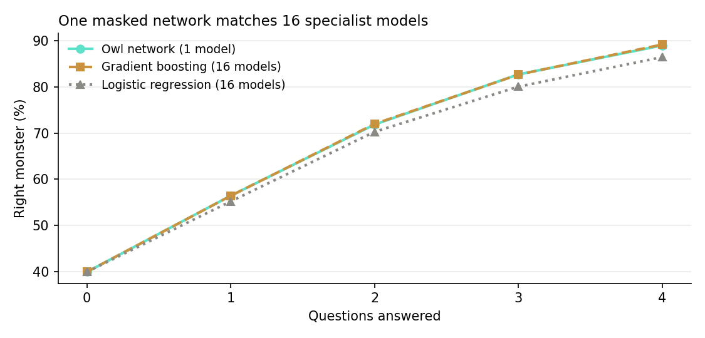
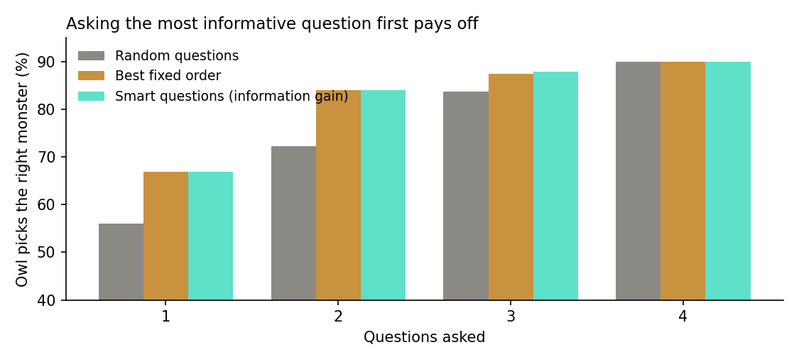
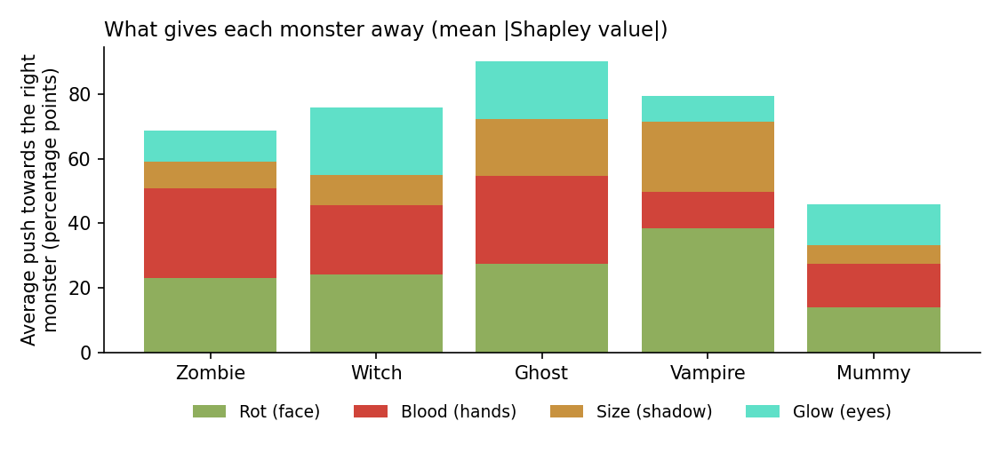

# Boo Who? - AI-Powered 3D Horror Game

**[Play it here!](https://blinasopjani.github.io/Boo-Who/)**

**Boo Who?** is a unique intersection of machine learning, data science, and 3D web gaming. At its core, it is an interactive data science experiment disguised as a spooky, browser-based horror game. 

Players must deduce the identity of procedurally generated monsters before they reach the village gate. Deductions rely on analyzing visual clues, evaluating rules extracted from a real dataset of 37,497 labeled monsters, and competing against an in-game AI (the "Owl") powered by a custom neural network.

---

##  Machine Learning & Data Science Core

This project is built from the ground up using a data-first approach, taking a raw dataset and transforming it into a fully playable web application.

### Data Engineering & Modeling
- **Data Preprocessing:** Cleaned and explored a raw dataset of 37,497 labeled monsters. Handled natural outliers, encoded categorical features, and applied robust scaling.
- **Model Selection & Tuning:** Evaluated Logistic Regression, Random Forest, LightGBM, and Neural Networks using 5-fold cross-validation. The final tuned LightGBM model achieved **88.9% accuracy and a 0.86 macro-F1 score** on a 7,500 unseen test set.
- **Rule Extraction:** Mined logical rules for each monster class directly from the data distribution to create the game mechanics. The rules players see on their cards mathematically reflect the underlying dataset.

### The AI "Owl" System
The in-game helper, the Owl, is driven by a custom Neural Network trained to evaluate incomplete information.
- **Masked Input Architecture:** Instead of building 16 separate models for every combination of known/unknown clues, a single network (11 inputs → 64 → 32 → 5 classes) handles any permutation. During training, every monster appears 16 times, hiding different sets of answers (479,952 total rows).
- **Information Theory:** The Owl calculates the **Expected Information Gain (Entropy)** for all 625 possible game states to recommend the optimal next question. (e.g., *Rot* removes about 1 bit of entropy, *Blood* 0.9).
- **Shapley Values:** Used exact Shapley values to explain the model's predictions, determining precisely which visual clues give each monster away.
- **Edge Deployment:** The trained model is exported to **ONNX** via `skl2onnx`, loaded using WebAssembly (`onnxruntime-web`), and executed natively in the browser with a pure JavaScript fallback.

---

##  Game Features & Mechanics

- **Dynamic Deductions:** Ask up to 4 questions per monster (rot, blood, size, glow color). Every question yields a clue but makes the monster walk 10% faster.
- **Compete with the AI:** The Owl AI evaluates the exact same evidence you do. The end-screen tracks your accuracy vs. the neural network.
- **Immersive 3D WebGL:** Built with `three.js`. Features atmospheric effects, low ground fog, dynamic lighting, procedural lightning, and jump scares.
- **Adaptive Difficulty:** As nights progress, "Trickster" monsters appear. These monsters intentionally break one of their dataset-derived rules, forcing you to rely on probabilistic guessing instead of strict logic.

---

##  Analytics & Visualizations

| One masked network matches 16 models | Smart questioning out-performs random | Feature importance via Shapley |
| :---: | :---: | :---: |
|  |  |  |

---

##  Repository Structure

| Path | Description |
| --- | --- |
| `notebooks/01_data_cleaning.ipynb` | Phase 1: Data exploration, checks, and cleaning |
| `notebooks/02_modeling.ipynb` | Phase 2: Model comparison, tuning, and initial exports |
| `notebooks/03_owl_any_clues.ipynb` | Phase 3: Subset networks for incomplete data |
| `notebooks/04_monster_rules.ipynb` | Phase 4: Rule extraction for gameplay cards |
| `notebooks/05_owl_brain.ipynb` | Phase 5: Masked neural network, entropy, Shapley values, ONNX export |
| `data/` | Original CSV files and preprocessed outputs |
| `reports/` | Cleaning reports and generated matplotlib charts |
| `web/src/` | Game source (`page.html`, `world.js`, `game.js`) |
| `web/js/` | ML Inference code (`brain.js`, `oracle.js`) |
| `web/data/` | Exported AI weights (`owl_brain.onnx`, `owl_brain.json`) |
| `web/build.py` | Python build script to bundle the game into a single HTML file |
| `docs/index.html` | The final compiled game (served by GitHub Pages) |

---

##  Setup & Execution

To explore the data science workflow:
```bash
pip install -r requirements.txt
```

Run the Jupyter notebooks in order (`01` through `05`). The notebooks will train the models, extract the rules, generate the charts, and export the ONNX weights.

To build the game after making changes to `web/src/`:
```bash
python web/build.py
```

##  Built With
- **AI & Data Science:** Python, Pandas, Scikit-Learn, LightGBM, Matplotlib, ONNX, ONNX Runtime Web
- **Frontend & 3D:** JavaScript, Three.js, HTML/CSS
- **Assets:** 3D models by [Quaternius](https://quaternius.com) (CC0)
